# PROCURA — Diagrammes Mermaid Complets
## Cahier des Charges Officiel v1.0 — Plateforme Source-to-Contract On-Premise

> Ce fichier regroupe **tous les diagrammes techniques et fonctionnels** extraits du cahier des charges, modélisés en syntaxe **Mermaid** pour visualisation sur GitHub, GitLab, VS Code ou tout renderer compatible Mermaid.

---

## 📑 Table des Diagrammes

| # | Nom | Type Mermaid |
|---|-----|-------------|
| 1 | Architecture Globale — Zones Réseau | `flowchart` |
| 2 | Workflow Métier Global (9 étapes) | `flowchart` |
| 3 | Cas d'Utilisation — Vue Globale | `flowchart` |
| 4 | Use Cases Détaillés par Acteur | `flowchart` |
| 5 | Diagramme de Séquence — Création & Publication RFQ | `sequenceDiagram` |
| 6 | Diagramme de Séquence — Dépôt d'Offre Fournisseur | `sequenceDiagram` |
| 7 | Diagramme de Séquence — Ouverture des Plis (Commission) | `sequenceDiagram` |
| 8 | Diagramme de Séquence — Transmission ERP | `sequenceDiagram` |
| 9 | Diagramme de Classes — Modèle de Données | `classDiagram` |
| 10 | Diagramme d'Activité — Cycle Source-to-Contract | `flowchart` |
| 11 | Architecture de Déploiement (Docker / K8s On-Premise) | `flowchart` |
| 12 | Architecture de Sécurité (Zero Trust, PKI, HSM) | `flowchart` |
| 13 | Architecture des Données (PostgreSQL, MinIO, WORM, Redis) | `flowchart` |
| 14 | Architecture du Coffre-Fort Numérique | `flowchart` |
| 15 | Architecture Monitoring (Prometheus, Grafana, ELK, Wazuh) | `flowchart` |
| 16 | Architecture Intégration ERP | `flowchart` |
| 17 | Flux de Traitement des Offres (Dépôt → Scellage → LAN) | `flowchart` |
| 18 | Matrice RBAC — Rôles & Permissions | `flowchart` |
| 19 | Diagramme d'État — Cycle de Vie d'une RFQ | `stateDiagram-v2` |
| 20 | Diagramme d'État — Cycle de Vie d'une Offre | `stateDiagram-v2` |
| 21 | Roadmap MVP → V3 (Gantt) | `gantt` |
| 22 | Diagramme de Gouvernance (RACI) | `flowchart` |
| 23 | Cartographie des 22 Modules | `flowchart` |
| 24 | Flux de Communication Inter-Zones | `flowchart` |

---

## 1️⃣ Architecture Globale — Zones Réseau

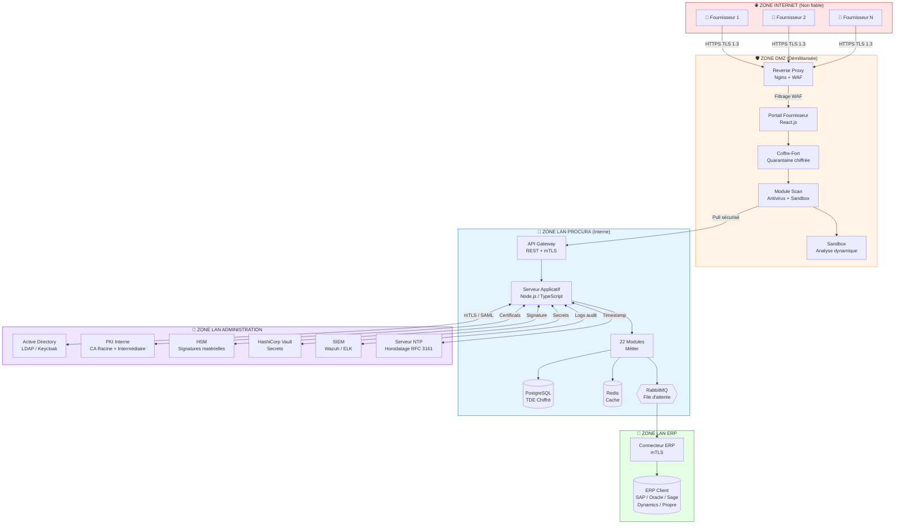

---

## 2️⃣ Workflow Métier Global (9 étapes)

```mermaid
flowchart LR
    E1[1️⃣ Expression<br/>du Besoin<br/>Portail Interne] -->|Validation<br/>multi-niveaux| E2[2️⃣ Validation<br/>Interne<br/>Manager/Achat/Finance]
    E2 -->|Besoin validé| E3[3️⃣ Création RFQ<br/>Acheteur<br/>+ Sélection fournisseurs ERP]
    E3 -->|Scellage HSM<br/>Hash + Signature| E4[4️⃣ Publication<br/>LAN → DMZ<br/>Coffre-fort]
    E4 -->|Invitation email<br/>Lien unique| E5[5️⃣ Réception Offres<br/>Fournisseurs<br/>Portail DMZ]
    E5 -->|Deadline atteinte| E6[6️⃣ Ouverture des Plis<br/>Commission<br/>Authentification MFA]
    E6 -->|Plis déverrouillés| E7[7️⃣ Commission<br/>Décisions + PV<br/>numérique signé]
    E7 -->|Output validé| E8[8️⃣ Génération<br/>Output Final<br/>JSON/XML/CSV normalisé]
    E8 -->|Transmission mTLS| E9[9️⃣ Transmission ERP<br/>Connecteur<br/>File d'attente]

    style E1 fill:#e3f2fd
    style E2 fill:#e3f2fd
    style E3 fill:#fff3e0
    style E4 fill:#fff3e0
    style E5 fill:#fce4ec
    style E6 fill:#f3e5f5
    style E7 fill:#f3e5f5
    style E8 fill:#e8f5e9
    style E9 fill:#e8f5e9
```

---

## 3️⃣ Cas d'Utilisation — Vue Globale

```mermaid
flowchart TB
    subgraph ACTEURS["👥 Acteurs"]
        ACH[Acheteur]
        DEM[Demandeur]
        FOU[Fournisseur]
        COM[Commission]
        ADM[Administrateur]
        ERP[ERP Client]
    end

    subgraph UC_ACH["📦 Use Cases Acheteur"]
        UC1[Consulter dashboard RFQ]
        UC2[Créer RFQ depuis besoin]
        UC3[Sélectionner fournisseurs ERP]
        UC4[Paramétrer dates & critères]
        UC5[Jointre documents]
        UC6[Valider & publier RFQ]
        UC7[Suivre invitations]
        UC8[Consulter offres après ouverture]
        UC9[Exporter comparatifs]
        UC10[Transmettre ERP]
    end

    subgraph UC_DEM["📋 Use Cases Demandeur"]
        UC11[Créer expression besoin]
        UC12[Renseigner formulaire structuré]
        UC13[Jointre docs techniques]
        UC14[Soumettre pour validation]
        UC15[Suivre état demande]
        UC16[Consulter décision]
    end

    subgraph UC_FOU["📨 Use Cases Fournisseur"]
        UC17[Recevoir invitation email]
        UC18[S'authentifier MFA/mTLS]
        UC19[Consulter documents RFQ]
        UC20[Déposer offre PDF/CSV/JPEG]
        UC21[Accusé réception horodaté]
        UC22[Suivre soumission]
        UC23[Ticket post-décision]
    end

    subgraph UC_COM["⚖️ Use Cases Commission"]
        UC24[S'authentifier MFA]
        UC25[Vérifier conditions ouverture]
        UC26[Initier ouverture officielle]
        UC27[Consulter offres déverrouillées]
        UC28[Saisir observations/décisions]
        UC29[Valider PV numérique]
        UC30[Archiver séance]
    end

    subgraph UC_ADM["🔧 Use Cases Administrateur"]
        UC31[Gérer utilisateurs & rôles]
        UC32[Configurer workflows]
        UC33[Paramétrer délais]
        UC34[Superviser services]
        UC35[Gérer templates notification]
        UC36[Administrer connecteurs ERP]
        UC37[Exporter journaux audit]
        UC38[Gérer certificats PKI]
    end

    ACH --> UC1 & UC2 & UC3 & UC4 & UC5 & UC6 & UC7 & UC8 & UC9 & UC10
    DEM --> UC11 & UC12 & UC13 & UC14 & UC15 & UC16
    FOU --> UC17 & UC18 & UC19 & UC20 & UC21 & UC22 & UC23
    COM --> UC24 & UC25 & UC26 & UC27 & UC28 & UC29 & UC30
    ADM --> UC31 & UC32 & UC33 & UC34 & UC35 & UC36 & UC37 & UC38
    ERP -.->|Réception| UC10

    style ACTEORS fill:#fff9c4
```

---

## 4️⃣ Use Cases Détaillés par Acteur (Vue agrégée)

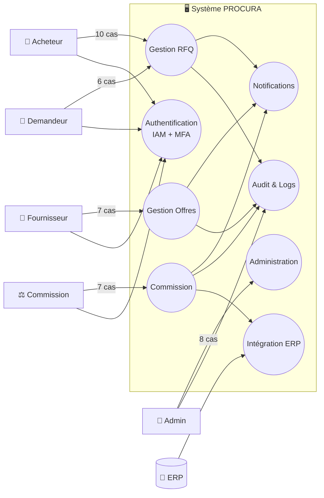

---

## 5️⃣ Diagramme de Séquence — Création & Publication RFQ

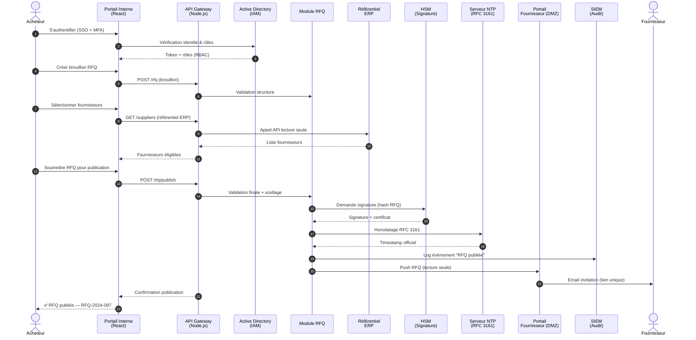

---

## 6️⃣ Diagramme de Séquence — Dépôt d'Offre Fournisseur

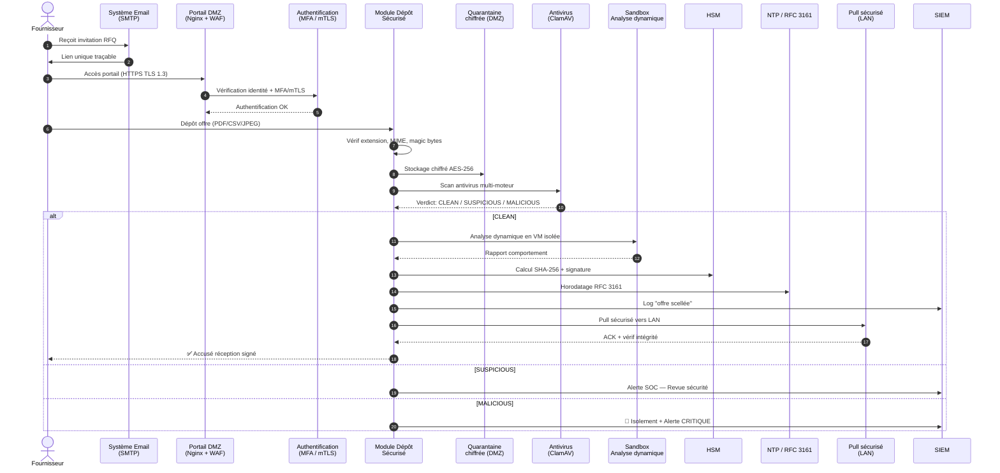

---

## 7️⃣ Diagramme de Séquence — Ouverture des Plis (Commission)

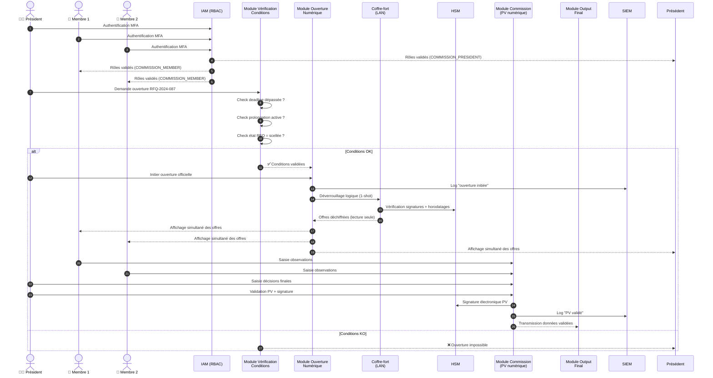

---

## 8️⃣ Diagramme de Séquence — Transmission ERP

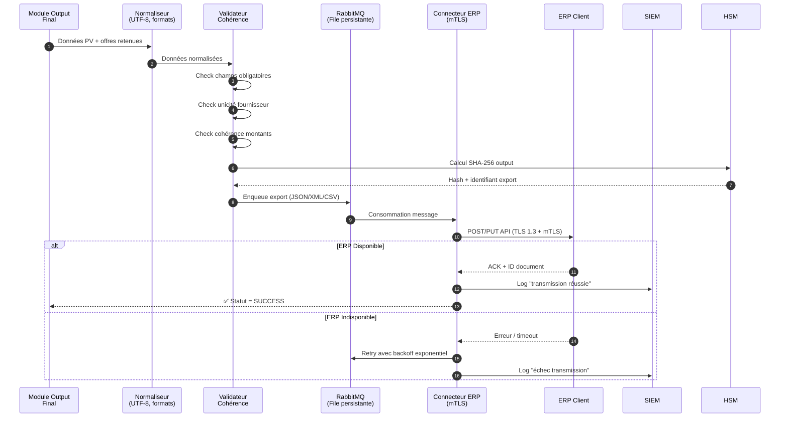

---

## 9️⃣ Diagramme de Classes — Modèle de Données

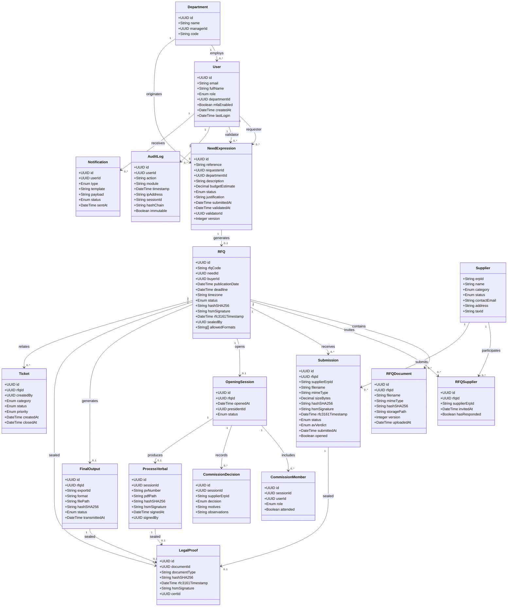

---

## 🔟 Diagramme d'Activité — Cycle Source-to-Contract

```mermaid
flowchart TD
    START([🚀 Démarrage]) --> EB[Expression du Besoin<br/>par Demandeur]
    EB --> VALID1{Validation<br/>interne<br/>multi-niveaux}
    VALID1 -->|Refusé| REFUSE1[❌ Besoin refusé<br/>avec justification]
    REFUSE1 --> NOTIF1[Notification demandeur]
    VALID1 -->|Validé| CREATE_RFQ[Acheteur crée RFQ<br/>+ sélection fournisseurs ERP]

    CREATE_RFQ --> SEAL[Scellage RFQ<br/>Hash SHA-256<br/>Signature HSM<br/>Timestamp RFC 3161]
    SEAL --> PUBLISH[Publication LAN → DMZ<br/>en lecture seule]
    PUBLISH --> INVITE[📧 Invitations fournisseurs<br/>via email sécurisé]
    INVITE --> WAIT[⏳ Fenêtre de dépôt<br/>ouverte]

    WAIT --> DEPOT{Fournisseurs<br/>déposent offres}
    DEPOT -->|Hors délai| LATE[❌ Rejet automatique]
    DEPOT -->|Dans délai| QUARANT[Stockage quarantaine<br/>chiffrée DMZ]
    QUARANT --> SCAN[Scan AV + Sandbox]
    SCAN -->|MALICIOUS| ALERT_SOC[🚨 Alerte SOC<br/>Isolement]
    SCAN -->|CLEAN/SUSPICIOUS| SCELL_OFFRE[Scellage offre<br/>SHA-256 + HSM + RFC 3161]
    SCELL_OFFRE --> PULL[Pull sécurisé DMZ → LAN]

    PULL --> DEADLINE{Date limite<br/>atteinte ?}
    DEADLINE -->|Non| WAIT
    DEADLINE -->|Oui| VEROUILLAGE[Verrouillage automatique<br/>Portail fermé]
    VEROUILLAGE --> OUVERTURE{Commission<br/>initie ouverture}
    OUVERTURE -->|Conditions OK| DEVERR[Déverrouillage<br/>logique unique]
    OUVERTURE -->|Conditions KO| BLOCK[❌ Blocage]

    DEVERR --> CONSULTE[👥 Consultation<br/>simultanée offres<br/>en lecture seule]
    CONSULTE --> DECISIONS[Saisie décisions<br/>par Commission]
    DECISIONS --> PV[Génération PV<br/>numérique signé]
    PV --> OUTPUT[Génération Output Final<br/>JSON / XML / CSV normalisé]
    OUTPUT --> COHER[Contrôle cohérence<br/>+ Hash SHA-256]
    COHER --> TRANSMIT[📤 Transmission ERP<br/>via mTLS]
    TRANSMIT --> ACK{ERP ACK ?}
    ACK -->|Oui| SUCCESS([✅ Succès<br/>Dossier archivé WORM])
    ACK -->|Non| RETRY[🔄 Retry<br/>file persistante]
    RETRY --> TRANSMIT

    style START fill:#4caf50,color:#fff
    style SUCCESS fill:#4caf50,color:#fff
    style REFUSE1 fill:#f44336,color:#fff
    style BLOCK fill:#f44336,color:#fff
    style LATE fill:#ff9800,color:#fff
    style ALERT_SOC fill:#f44336,color:#fff
```

---

## 1️⃣1️⃣ Architecture de Déploiement (Docker / K8s On-Premise)

```mermaid
flowchart TB
    subgraph CLIENT_DC["🏢 Data Center Client (On-Premise)"]
        subgraph HARDENING["🔒 OS Hardening"]
            OS[OS durci<br/>CIS Benchmarks]
        end

        subgraph FW["🔥 Firewalls Inter-zones"]
            FW1[FW Internet ↔ DMZ]
            FW2[FW DMZ ↔ LAN]
            FW3[FW LAN ↔ ERP]
            FW4[FW LAN ↔ Admin]
        end

        subgraph DMZ_ZONE["🛡️ DMZ Cluster"]
            NGINX[Reverse Proxy<br/>Nginx + ModSecurity]
            WAF[WAF<br/>OWASP Rules]
            PORTAL_APP[Portail Fournisseur<br/>React Container]
            DEPOT_SVC[Service Dépôt Offres<br/>Node.js Container]
            SCAN_SVC[Service Scan/Sandbox<br/>ClamAV + Sandbox VM]
        end

        subgraph LAN_ZONE["🏢 LAN Procura Cluster"]
            API_GW[API Gateway<br/>Node.js + Express]
            AUTH_SVC[Service Auth<br/>IAM + MFA]
            RFQ_SVC[Service RFQ]
            COMMISSION_SVC[Service Commission]
            OUTPUT_SVC[Service Output ERP]
            NOTIF_SVC[Service Notifications]
            WORKER[Workers async<br/>BullMQ + Redis]
        end

        subgraph DATA["💾 Couche Données"]
            PG[(PostgreSQL 16<br/>TDE Chiffré)]
            MINIO[(MinIO S3<br/>SSE-C Chiffré)]
            REDIS[(Redis 7<br/>Cache + Queue)]
            RABBIT[{{RabbitMQ<br/>File persistante}}]
            WORM[(Archivage WORM<br/>MinIO Object Lock)]
        end

        subgraph ADMIN_ZONE["🔐 Zone Admin"]
            VAULT_SVC[HashiCorp Vault<br/>Secrets]
            HSM_SVC[HSM Physique<br/>PKCS#11]
            PKI_SVC[PKI Interne<br/>EJBCA]
            LDAP_SVC[Active Directory<br/>LDAPS]
            NTP_SVC[NTP Serveur<br/>Stratum 1]
            SIEM_SVC[SIEM<br/>Wazuh + ELK]
            SMTP_SVC[SMTP<br/>Postfix]
        end

        subgraph MONITOR["📊 Monitoring"]
            PROM[Prometheus]
            GRAF[Grafana]
            LOKI[Loki]
            ALERT[Alertmanager]
        end

        OS --> FW
        FW1 --> NGINX
        FW1 --> WAF
        NGINX --> PORTAL_APP
        WAF --> DEPOT_SVC
        DEPOT_SVC --> SCAN_SVC

        FW2 --> API_GW
        API_GW --> AUTH_SVC
        API_GW --> RFQ_SVC
        API_GW --> COMMISSION_SVC
        API_GW --> OUTPUT_SVC
        API_GW --> NOTIF_SVC
        RFQ_SVC --> WORKER

        API_GW --> PG
        API_GW --> MINIO
        API_GW --> REDIS
        WORKER --> RABBIT
        MINIO --> WORM

        FW3 -.-> ERP[(ERP Client)]
        FW4 --> VAULT_SVC
        FW4 --> HSM_SVC
        FW4 --> PKI_SVC
        FW4 --> LDAP_SVC
        FW4 --> NTP_SVC
        FW4 --> SIEM_SVC
        FW4 --> SMTP_SVC

        PROM --> GRAF
        PROM --> ALERT
        SIEM_SVC --> LOKI
    end
```

---

## 1️⃣2️⃣ Architecture de Sécurité (Zero Trust, PKI, HSM)

```mermaid
flowchart TB
    subgraph PRINCIPES["🛡️ Principes Fondateurs"]
        P1[Security by Design]
        P2[Zero Trust<br/>Aucun composant n'est implicitement fiable]
        P3[Défense en Profondeur]
        P4[Least Privilege]
    end

    subgraph AUTH_LAYER["🔑 Couche Authentification"]
        MFA[MFA obligatoire<br/>Admin + Commission]
        SAML[SSO SAML 2.0 / OIDC]
        LDAP_INTEG[AD / LDAP / Keycloak]
        SESSION[Sessions chiffrées<br/>HttpOnly + Secure<br/>Expiration auto]
        BRUTE[Blocage après<br/>5 échecs]
    end

    subgraph ENCRYPT["🔒 Couche Chiffrement"]
        TLS[TLS 1.3<br/>Tous flux]
        MTLS[mTLS<br/>Services critiques]
        AES256[AES-256<br/>Données au repos]
        TDE[TDE PostgreSQL]
        SSEC[SSE-C MinIO]
        VAULT_SEC[Vault<br/>Secrets centralisés]
    end

    subgraph PKI_HSM["🔐 PKI & HSM"]
        CA_ROOT[CA Racine<br/>Offline]
        CA_INT[CA Intermédiaire<br/>Services]
        CERT_SRV[Certificats services<br/>Rotation auto]
        HSM_DEV[HSM Physique<br/>FIPS 140-2]
        SIGN[Signature électronique<br/>PKCS#11]
    end

    subgraph AUDIT_SEC["📜 Audit & Conformité"]
        LOG_IMMU[Logs immuables<br/>Hash chainés]
        SIEM_SOC[SIEM SOC<br/>Wazuh]
        OWASP[Protection OWASP Top 10]
        ANOMALY[Détection anomalies<br/>comportementales]
        EXPORT_LOG[Export logs<br/>PDF / CSV / JSON]
    end

    subgraph TIMESTAMP["⏰ Horodatage Légal"]
        RFC3161[RFC 3161<br/>Timestamping Protocol]
        NTP_SYNC[NTP Stratum 1<br/>Synchronisation]
        LEGAL_PROOF[Preuves légales<br/>UUID + Hash + Timestamp + Signature]
    end

    subgraph NETWORK_SEC["🌐 Sécurité Réseau"]
        VLAN[VLAN segmentation]
        FW_STATE[Firewalls stateful]
        IDS_IPS[IDS / IPS]
        DMZ_ISO[Isolation DMZ]
    end

    PRINCIPES --> AUTH_LAYER
    AUTH_LAYER --> ENCRYPT
    ENCRYPT --> PKI_HSM
    PKI_HSM --> AUDIT_SEC
    AUDIT_SEC --> TIMESTAMP
    PRINCIPES --> NETWORK_SEC

    style PRINCIPES fill:#fff3e0
    style AUTH_LAYER fill:#e3f2fd
    style ENCRYPT fill:#f3e5f5
    style PKI_HSM fill:#fce4ec
    style AUDIT_SEC fill:#e8f5e9
    style TIMESTAMP fill:#fff9c4
    style NETWORK_SEC fill:#ffebee
```

---

## 1️⃣3️⃣ Architecture des Données (PostgreSQL, MinIO, WORM, Redis)

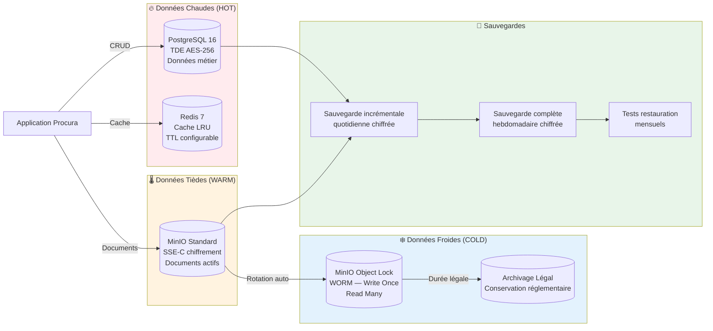

---

## 1️⃣4️⃣ Architecture du Coffre-Fort Numérique

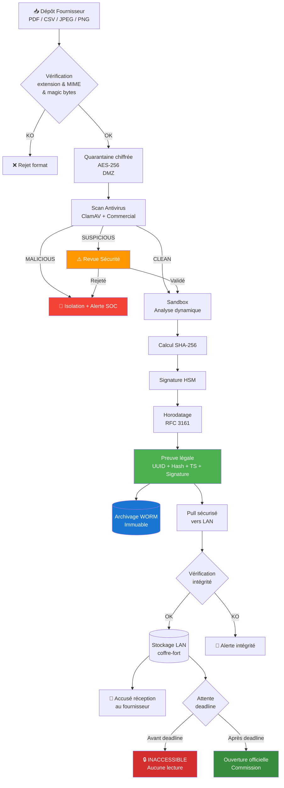

---

## 1️⃣5️⃣ Architecture Monitoring (Prometheus, Grafana, ELK, Wazuh)

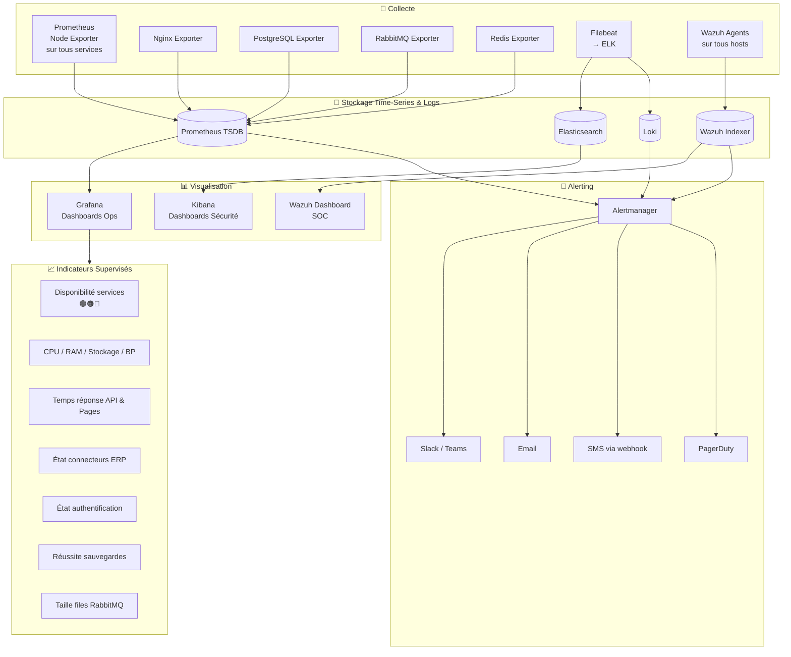

---

## 1️⃣6️⃣ Architecture Intégration ERP

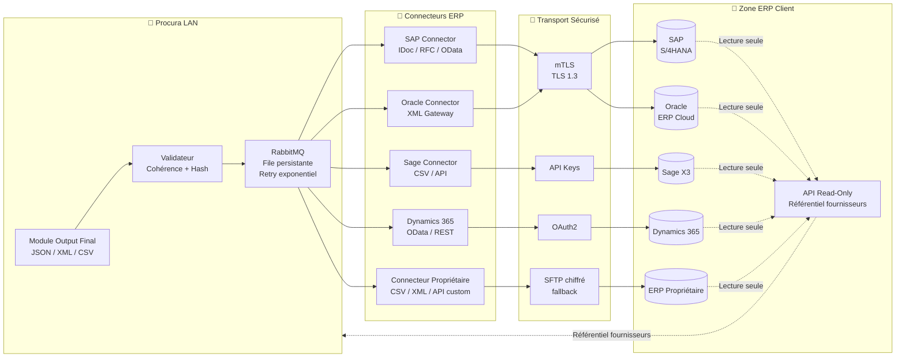

---

## 1️⃣7️⃣ Flux de Traitement des Offres (Dépôt → Scellage → LAN)

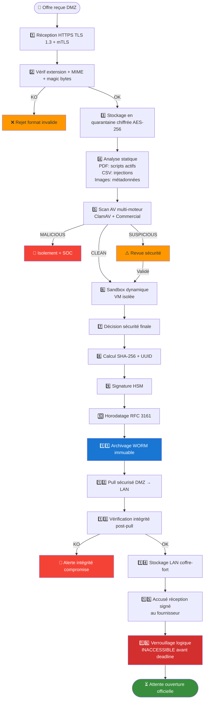

---

## 1️⃣8️⃣ Matrice RBAC — Rôles & Permissions

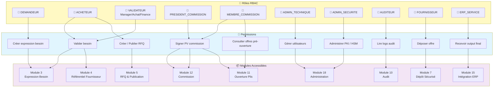

---

## 1️⃣9️⃣ Diagramme d'État — Cycle de Vie d'une RFQ

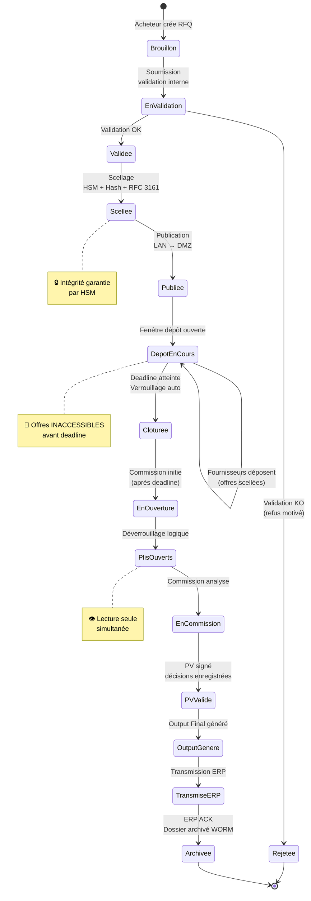

---

## 2️⃣0️⃣ Diagramme d'État — Cycle de Vie d'une Offre

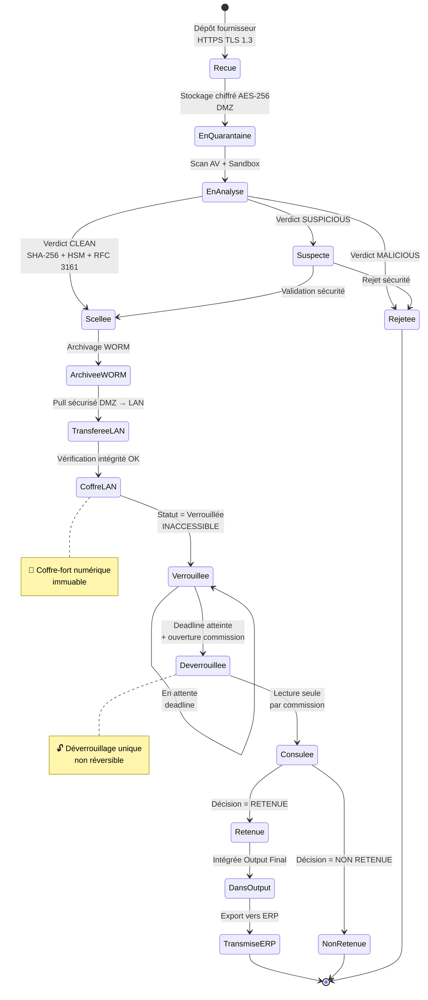

---

## 2️⃣1️⃣ Roadmap MVP → V3 (Gantt)

```mermaid
gantt
    title Roadmap PROCURA — MVP → V3
    dateFormat  YYYY-MM-DD
    axisFormat  %b

    section Phase MVP (M1-M4)
    Module 1 - Architecture & Déploiement      :m1, 2026-01-01, 30d
    Module 2 - Gestion utilisateurs & RBAC     :m2, after m1, 30d
    Module 3 - Expression besoin simplifié     :m3, after m2, 25d
    Module 5 - RFQ basique + publication       :m4, after m3, 30d
    Module 6 - Portail fournisseur (PDF)       :m5, after m4, 30d
    Module 7 - Dépôt sécurisé + AV             :m6, after m5, 25d
    Module 9 - Deadlines & verrouillage        :m7, after m6, 20d
    Module 10 - Audit & traçabilité de base    :m8, after m7, 20d
    Module 17 - Notifications email            :m9, after m8, 15d

    section Phase V1 (M5-M8)
    Module 4 - Référentiel fournisseur ERP     :v1a, 2026-05-01, 30d
    Module 8 - RFC 3161 & HSM                  :v1b, after v1a, 25d
    Module 11 - Ouverture plis numérique       :v1c, after v1b, 25d
    Module 12 - Commission + PV numérique      :v1d, after v1c, 25d
    Module 13 - Analyse & comparatifs          :v1e, after v1d, 20d
    Module 14 - Output Final                   :v1f, after v1e, 20d
    Module 15 - Intégration ERP (SAP/Oracle/Sage):v1g, after v1f, 30d
    Module 18 - Administration & paramétrage   :v1h, after v1g, 25d
    Module 19 - Sécurité (WAF/Sandbox/PKI)     :v1i, after v1h, 30d

    section Phase V2 (M9-M12)
    Module 16 - Ticketing post-décision        :v2a, 2026-09-01, 25d
    Module 20 - Archivage WORM                  :v2b, after v2a, 20d
    Module 21 - Monitoring avancé              :v2c, after v2b, 30d
    Module 22 - Documentation & support        :v2d, after v2c, 20d
    Tests de charge + sécurité + audit externe :v2e, after v2d, 30d
    Optimisations performance & UX            :v2f, after v2e, 20d

    section Phase V3 (M13+)
    Multi-entités / multi-sites                :v3a, 2027-01-01, 60d
    Connecteurs ERP supplémentaires            :v3b, after v3a, 45d
    Module BI avancée & KPIs achats            :v3c, after v3b, 60d
    Formats e-procurement / PEPPOL             :v3d, after v3c, 45d
    Certification ISO 27001                    :v3e, after v3d, 90d
    Expansion multi-marchés                    :v3f, after v3e, 60d
```

---

## 2️⃣2️⃣ Diagramme de Gouvernance (RACI)

```mermaid
flowchart TB
    subgraph COMITES["🏛️ Comités de Gouvernance"]
        COPIL[Comité de Pilotage<br/>📅 Mensuel<br/>Décisions stratégiques]
        COTECH[Comité Technique<br/>📅 Hebdomadaire<br/>Revue technique & blocages]
        COSEC[Comité Sécurité<br/>📅 À chaque livraison majeure<br/>Validation sécurité]
        COSPR[Revue de Sprint<br/>📅 Bi-mensuelle<br/>Démo fonctionnalités]
    end

    subgraph ACTEURS_GOV["👥 Acteurs"]
        SP[🚀 Sponsor]
        CDO[👤 Chef de Projet]
        ARCH[🏗️ Architecte]
        LEAD[👨‍💻 Lead Dev]
        DEV[👨‍💻 Équipe Dev]
        SEC[🔐 RSSI]
        QA[✅ QA Lead]
        CLIENT[🏢 Client]
    end

    subgraph MATRICE["📋 Matrice RACI (extrait)"]
        R1[Conception architecture<br/>A=ARCH, R=LEAD, C=SEC, I=CDO]
        R2[Développement modules<br/>A=LEAD, R=DEV, C=ARCH, I=CDO]
        R3[Tests sécurité<br/>A=SEC, R=QA, C=ARCH, I=CDO]
        R4[Recette utilisateur<br/>A=CLIENT, R=QA, C=CDO, I=SP]
        R5[Validation sécurité<br/>A=SEC, R=ARCH, C=CDO, I=SP]
        R6[Décisions budget<br/>A=SP, R=CDO, C=ARCH, I=CLIENT]
    end

    SP --> COPIL
    CDO --> COPIL & COTECH & COSPR
    SEC --> COSEC
    ARCH --> COTECH & COSEC
    LEAD --> COSPR
    CLIENT --> COPIL & COSPR

    ACTEURS_GOV --> MATRICE

    style COPIL fill:#1976d2,color:#fff
    style COTECH fill:#388e3c,color:#fff
    style COSEC fill:#d32f2f,color:#fff
    style COSPR fill:#f57c00,color:#fff
```

> **Légende RACI** : **R** = Responsible (exécute) · **A** = Accountable (responsable final) · **C** = Consulted (consulté) · **I** = Informed (informé)

---

## 2️⃣3️⃣ Cartographie des 22 Modules

```mermaid
flowchart TB
    subgraph INFRA["🏗️ INFRASTRUCTURE & SÉCURITÉ"]
        M1[Module 1<br/>Architecture & Déploiement]
        M2[Module 2<br/>Gestion Utilisateurs & RBAC]
        M19[Module 19<br/>Sécurité Globale]
        M20[Module 20<br/>Archivage & Conservation Légal]
        M21[Module 21<br/>Monitoring & Exploitation]
        M22[Module 22<br/>Documentation & Support]
    end

    subgraph METIER["💼 CŒUR MÉTIER (Source-to-Contract)"]
        M3[Module 3<br/>Expression du Besoin]
        M4[Module 4<br/>Référentiel Fournisseur ERP]
        M5[Module 5<br/>Lancement RFQ & Publication]
        M6[Module 6<br/>Portail Fournisseur DMZ]
        M7[Module 7<br/>Dépôt Sécurisé des Offres]
        M9[Module 9<br/>Gestion Deadlines & Verrouillage]
        M11[Module 11<br/>Ouverture des Plis Numérique]
        M12[Module 12<br/>Commission d'Ouverture]
        M13[Module 13<br/>Analyse & Structuration]
        M14[Module 14<br/>Génération Output Final]
    end

    subgraph TRANSVERSE["🔄 MODULES TRANSVERSES"]
        M8[Module 8<br/>Horodatage & Preuve Légale<br/>RFC 3161 + HSM]
        M10[Module 10<br/>Audit & Traçabilité]
        M15[Module 15<br/>Intégration ERP]
        M16[Module 16<br/>Communication Collaborative<br/>Ticketing]
        M17[Module 17<br/>Notifications & Messagerie]
        M18[Module 18<br/>Administration & Paramétrage]
    end

    M3 --> M5
    M5 --> M6
    M6 --> M7
    M7 --> M9
    M9 --> M11
    M11 --> M12
    M12 --> M13
    M13 --> M14
    M14 --> M15

    M8 -.-> M5 & M7 & M11 & M12 & M14
    M10 -.->|Audit tous| M3 & M5 & M7 & M11 & M12
    M17 -.->|Notif tous| M3 & M5 & M6 & M9 & M11 & M12
    M2 -.->|RBAC| M3 & M5 & M6 & M11
    M19 -.->|Sécurité| M6 & M7
    M20 -.->|Archive| M5 & M7 & M12 & M14
    M21 -.->|Supervision| M1 & M6 & M7
    M22 -.->|Docs| M18 & M21

    style INFRA fill:#e3f2fd
    style METIER fill:#fff3e0
    style TRANSVERSE fill:#f3e5f5
```

---

## 2️⃣4️⃣ Flux de Communication Inter-Zones

```mermaid
sequenceDiagram
    autonumber
    actor Fournisseur
    participant RP as Reverse Proxy<br/>(DMZ)
    participant Portal as Portail<br/>(DMZ)
    participant Depot as Dépôt<br/>(DMZ)
    participant Sandbox as Sandbox<br/>(DMZ)
    participant App as App Server<br/>(LAN)
    participant DB as PostgreSQL<br/>(LAN)
    participant ERP as ERP<br/>(LAN ERP)
    participant HSM as HSM<br/>(LAN Admin)
    participant SIEM as SIEM<br/>(LAN Admin)
    participant LDAP as AD/LDAP<br/>(LAN Admin)

    Note over Fournisseur,LDAP: 🌐 Étape 1 — Authentification Fournisseur
    Fournisseur->>RP: HTTPS TLS 1.3 + MFA/mTLS
    RP->>Portal: Routage authentifié
    Portal->>LDAP: Vérification identité (via API interne mTLS)
    LDAP-->>Portal: Identité validée

    Note over Fournisseur,LDAP: 📨 Étape 2 — Dépôt Offre
    Fournisseur->>Portal: Upload offre
    Portal->>Depot: Transfert chiffré AES-256
    Depot->>Sandbox: Analyse dynamique

    Note over Fournisseur,LDAP: 🔐 Étape 3 — Scellage & Signature
    Depot->>HSM: Demande signature (mTLS)
    HSM-->>Depot: Signature + certificat

    Note over Fournisseur,LDAP: 📤 Étape 4 — Pull vers LAN
    Depot->>App: Pull sécurisé (offre scellée)
    App->>DB: Persistance données (TDE)
    App->>SIEM: Log audit (mTLS)

    Note over Fournisseur,LDAP: 💼 Étape 5 — Transmission ERP
    App->>ERP: POST output final (mTLS + API Key/OAuth2)
    ERP-->>App: ACK + ID document
    App->>SIEM: Log transmission
```

---

## 📌 Notes de Conformité

| Texte | Application |
|-------|-------------|
| **Loi 23-12** (Cybersécurité, Algérie) | Notification incidents, journalisation SOC, hébergement national |
| **Loi 18-07** (Données personnelles, Algérie) | Hébergement local strict, minimisation, droit à l'information |
| **Décret Marchés Publics** | Commission ouverture plis physique préservée, égalité de traitement, traçabilité légale |
| **ISO 27001:2022** | SMSI, gestion des risques, contrôles sécurité |
| **ISO 9001:2015** | Qualité, amélioration continue |
| **OWASP Top 10 (2021)** | Protection applicative |
| **RFC 3161** | Horodatage légal des preuves |
| **NIST SP 800-53 Rev.5** | Référentiel contrôles sécurité |
| **FIPS 140-2/3** | Modules cryptographiques (HSM) |
| **PKCS#11** | Interface HSM |
| **SAML 2.0 / OIDC** | SSO |
| **TLS 1.3** | Chiffrement transport |

---

## 🎯 Objectifs Stratégiques Mesurables

- ⏱️ **Time-to-market** cycle AO : **-30% à -50%**
- ✅ **Conformité audit** : 100%
- 🏰 **Souveraineté** : 100% on-premise
- 🔒 **Sécurité** : Chiffrement AES-256 + HSM + TLS 1.3 + mTLS
- 📊 **Couverture tests** : ≥ 80% backend (Jest)
- ⚡ **Performance** : < 2s (500 users) · < 30s (50 dépôts simultanés)
- 🛡️ **RTO** : < 4h · **RPO** : < 24h

---

**Fin du document — PROCURA Diagrammes Mermaid v1.0**
*Plateforme Source-to-Contract — On-Premise — 100% souveraine*