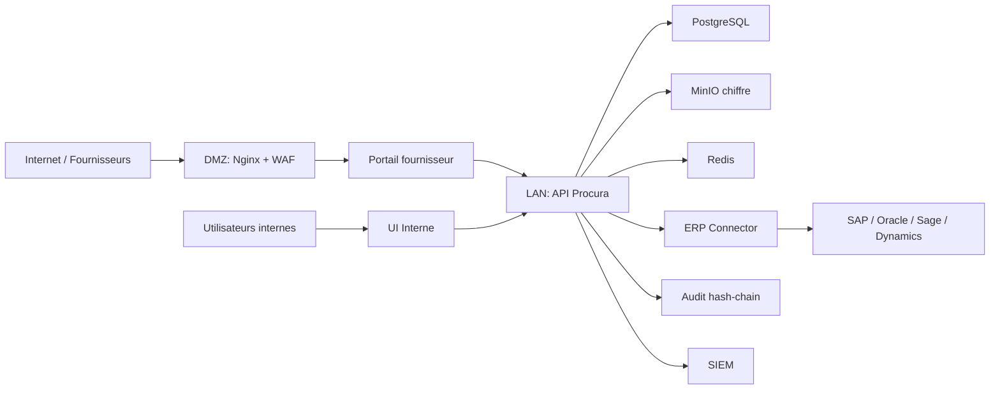

# Architecture Initiale

## Vue Logique

## Choix De Stack

- TypeScript partout pour partager les contrats metier.
- Fastify pour une API performante, explicite et testable.
- React + Vite pour demarrer vite avec une surface UI maintenable.
- Zod pour schemas runtime entre front, back et package partage.
- PostgreSQL cible pour donnees relationnelles.
- MinIO cible pour documents et offres scellees.
- Redis cible pour cache, sessions techniques et files legeres.

## Frontieres

- `packages/shared`: vocabulaire metier, statuts, permissions et schemas.
- `apps/api`: orchestration metier, securite, audit, connecteurs.
- `apps/web`: experience utilisateur, jamais source d'autorite securite.
- `infra`: services on-premise locaux pour developpement et integration.
