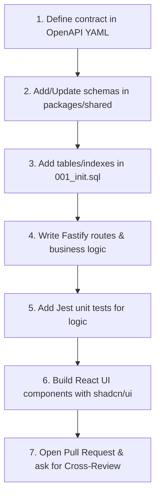

# Procura MVP — Developer Handbook & Standards

This document establishes the official development standards, git workflows, coding patterns, and security practices for **Procura**, a high-security, 100% on-premise Source-to-Contract (S2C) platform.

Every contribution must treat this platform as a **production-ready critical system** in alignment with international standards (ISO 27001, ISO 9001) and regulatory requirements (Algerian Laws 18-07 and 23-12).

---

## 🔐 1. Git Workflow & Collaboration

We enforce a strict branching and commit structure to maintain auditability and avoid conflicts between the Security layer (Arix) and the Software layer (Sofiane).

### 🌿 Branch Strategy

- `main`: Represents production-ready code. Locked for direct push. Merges require:
  - Both @arix and @sofiane approvals.
  - 100% passing CI/CD pipelines.
- `develop`: Integration branch. Merges require:
  - 1 approval (cross-review by the other developer).
  - Passing CI checks (linting, tests, static scans).
- `feature/arix/<description>`: Arix's sandbox for infrastructure, networks, and security configurations.
- `feature/sofiane/<description>`: Sofiane's sandbox for API, frontend, and database schema implementation.

### 📝 Commit Message Convention

We enforce **Conventional Commits** via commitlint and Husky. Commits violating this format will be rejected on `git commit`.

Format: `<type>(<scope>): <subject>`

- `feat`: A new user-facing business feature.
- `fix`: A bug fix.
- `infra`: Docker Compose, networks, routing, Nginx config changes (Arix zone).
- `sec`: Security improvements, policies, encryption settings, or Vault configs (Arix zone).
- `docs`: Documentation updates (ADRs, Runbooks, guides).
- `test`: Adding or correcting tests.
- `refactor`: Restructuring code without changing user-facing functionality.
- `chore`: Package updates, build configurations.

_Example_: `feat(rfq): add publication date validation to Zod schema`

---

## 💾 2. Database Schema & Migrations

PostgreSQL is the single source of truth for all operational states.

### 🗄️ Database Structure

- All schema definitions reside in `infra/db/001_init.sql`.
- Seed data for development is located in `infra/db/002_seed_dev.sql`.

### 🔄 Modifying the Schema

1. **Never** modify tables directly in the database without updating the scripts.
2. For schema changes, Sofiane designs the business columns, and Arix reviews the security/audit columns (hashes, signatures).
3. Update `infra/db/001_init.sql` directly during the MVP phase to keep a clean, single-point-of-truth schema.
4. To reload the schema locally during development:
   ```bash
   docker exec -i procura-postgres psql -U procura -d procura < infra/db/001_init.sql
   docker exec -i procura-postgres psql -U procura -d procura < infra/db/002_seed_dev.sql
   ```

---

## 🛠️ 3. Monorepo Architecture & Code Guidelines

Procura is structured as a pnpm workspace monorepo.

### 📦 Code Distribution

- `packages/shared`: Stores all Zod validation schemas, business enumerations, and helper utilities. This is the **single contract** shared between backend and frontend.
- `apps/api`: Fastify-based backend REST API.
- `apps/web`: React-based frontend web portal.

### 🧪 Schema-Driven Development (Zod)

Every database entity has a corresponding Zod schema in `packages/shared/src/index.ts`. All incoming requests in `apps/api` must be validated against these schemas.
_Example: Validating a new RFQ payload on backend_

```typescript
import { createRfqSchema } from "@procura/shared";

// In Fastify router:
const payload = createRfqSchema.parse(request.body);
```

### 🔒 Backend Logic & Security Rules

1. **RBAC Guard**: Every route containing state mutations or sensitive reads must be protected by the `requirePermission` middleware:
   ```typescript
   import { requirePermission } from "../../security/rbac.js";

   fastify.post(
     "/rfq",
     { preHandler: [requirePermission("rfq:create")] },
     handler,
   );
   ```
2. **Audit Logging**: Every mutation must emit an immutable structured log using the audit framework.
3. **No Raw Secrets**: Read all secrets from environment variables, which will be loaded from HashiCorp Vault in staging/production. Never commit plain keys, passwords, or tokens.

### 🎨 Frontend & shadcn/ui Styling

1. The frontend uses **Tailwind CSS v4** with a custom theme and PostCSS compilation.
2. Components are built using **shadcn/ui** design patterns:
   - Configured in `apps/web/components.json`.
   - Utilizes the `cn` utility from `@/ui/lib/utils` to merge styles.
   - Interactive components (dialogs, select, etc.) must be accessible (built on top of Radix UI primitives).

---

## 🛡️ 4. Code Quality & Pre-Commit Hooks

Husky intercepts commits to verify code quality locally:

1. **Commit Message**: Analyzed to ensure Conventional Commit structure.
2. **Code Linting & Formatting**: `lint-staged` runs ESLint and Prettier on changed files. If any formatting issues or lint errors are found, the commit is blocked until resolved.

To manually format and check the workspace:

```bash
pnpm format   # Run Prettier format
pnpm lint     # Run ESLint quality checks
pnpm test     # Run Jest unit test suite
```

---

## 🚀 5. Implementing a New Feature (Step-by-Step)

Follow this cycle for every new user story/feature:



1. **API Contract**: Write/update the YAML files in `contracts/openapi/`.
2. **Shared Package**: Update `packages/shared/src/index.ts` with new validation schemas and types. Run `pnpm --filter @procura/shared build`.
3. **Database Schema**: Update `infra/db/001_init.sql` and run it locally.
4. **Backend Implementation**: Implement controllers, inject storage/db clients, apply permission checks, and emit audit logs.
5. **Unit Testing**: Add `.spec.ts` files inside the module. Run `pnpm test` to ensure coverage remains above 80%.
6. **Frontend Integration**: Build UI views, import the Zod schemas for client-side forms, and connect components to the backend endpoints.
7. **PR & Review**: Push code to your feature branch, open a PR to `develop` describing **What**, **Why**, and **How to test**, and assign to the co-founder.
